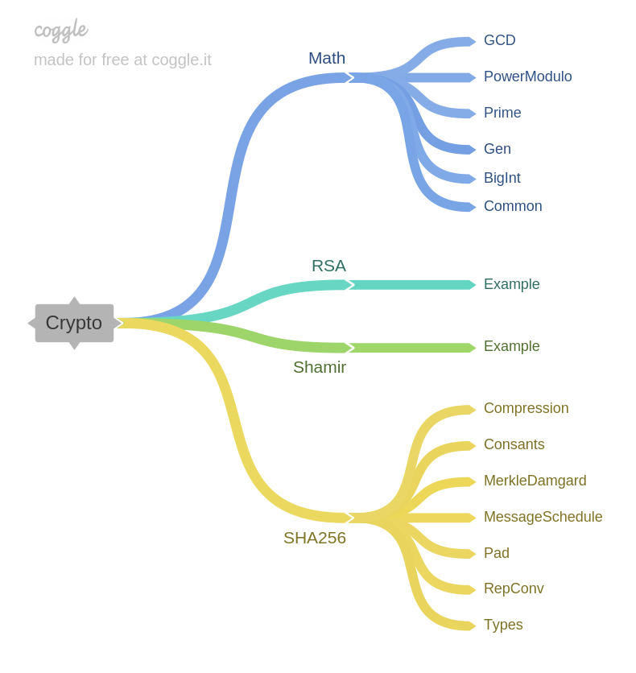

# Crypto

Implementations of cryptographic algorithms in Haskell. So far I have implemented:

- Textbook [RSA](https://en.wikipedia.org/wiki/RSA_(cryptosystem))
- [Shamir's Secret Sharing](https://en.wikipedia.org/wiki/Shamir%27s_Secret_Sharing)
- [SHA256](https://en.wikipedia.org/wiki/SHA-2)

In this project I strive (but do not claim I succeed) to follow these design principles:

- Elegance
- DRY
- KISS
- Narrow interfaces

## How to run

Change directory to `src/` and type `ghci`. Now load the module you want to run. Some modules require the package `MonadRandom`, which you can install with `cabal install MonadRandom`.

## Modules overview

### Math

The `Math` module provides discrete mathematics functions used by the cryptographic modules.

- `Divisibility` Divisibility test, Extended Euclidean Algorithm and co.
- `PowerModulo` Modular exponentiation done efficiently.
- `Prime` Primality testing using the Miller-Rabin test.
- `Gen` Generation of coprimes and primes.
- `BigInt` Data types with `Arbitrary` instances giving larger numbers. Used for testing-purposes.

### RSA

Implementation of textbook RSA.

- `Example` Example usage of the RSA library.

### Shamir

Implementation of Shamir's Secret Sharing.

- `Example` Example usage of the secret sharing scheme.

### SHA256 (WIP)

Implementation of SHA256.

- `Compression` Compression function used by SHA256.
- `Constants` Round constants and initial hash values.
- `MerkleDamgard` Function for calculating a Merkle-Damgård style hash function.
- `MessageSchedule` List for the message schedule array.
- `Pad` Padding for the pre-processing.
- `RepConv` Converting between different representations of words and lists of words.
- `Types` Synonyms for types used by the different functions.
- `Test` Comparsion between this implementation and a library function. This module requires the package `Crypto.Hash.SHA256` which can be installed with `cabal install cryptohash`.
