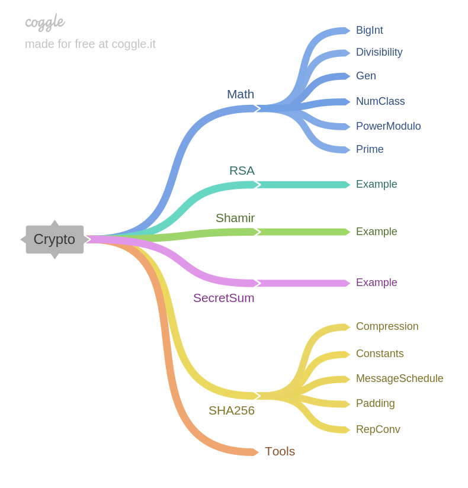

# Crypto

Implementations of cryptographic algorithms in Haskell. So far I have implemented

- Textbook [RSA](https://en.wikipedia.org/wiki/RSA_(cryptosystem))
- [Shamir's Secret Sharing](https://en.wikipedia.org/wiki/Shamir%27s_Secret_Sharing)
- Secret addition of numbers using [Secure Multi-Party Computation](https://en.wikipedia.org/wiki/Secure_multi-party_computation)
- [SHA256](https://en.wikipedia.org/wiki/SHA-2)

## How to run

Change directory to `src/` and type `ghci`. Now load the module you want to run.

## Modules overview

### Math

The `Math` module provides discrete mathematics functions used by the cryptographic modules.

- `BigInt` Integer types with `Arbitrary` instances giving large numbers. Used for testing.
- `Divisibility` Divisibility test, Extended Euclidean Algorithm and related.
- `Gen` Generation of coprimes and primes.
- `NumClass` A type class used as a shorthand for the multiple type classes required in many functions.
- `PowerModulo` Modular exponentiation done efficiently.
- `Prime` Primality testing using the Miller-Rabin test.

### RSA

Implementation of textbook RSA. Generation of keys, encryption, decryption, signing and verification. Check `RSA.Example` for example usage.

### Shamir

Implementation of Shamir's Secret Sharing. Check `Shamir.Example` for example usage, where Alice shares a secret with her friends.

### SecretSum

Allows multiple parties to calculate the sum of their inputs without revealing their input to anyone else. Check `SecretSum.Example` for example usage, where Alice and her friends compute a secret sum together.

### SHA256

Implementation of SHA256. The terminology follows closely to that of the [Wikipedia article](https://en.wikipedia.org/wiki/SHA-2). You need to install the package `cryptohash` with e.g. `cabal install cryptohash`. 

- `Compression` The inner compression loop.
- `MessageSchedule` Creation of the message schedule array.
- `Constants` Round constants for the compression loop and the initial hash values.
- `Padding`  Padding (pre-processing) of the byte string to be hashed.
- `RepConv` Converting between different representations of words and lists of words.

### Tools

Helper functions that are unrelated to cryptography and not specific to the project itself, but that are still useful here. For example, the `!!` function revamped to work with any `Integral` index and not just `Int`.
